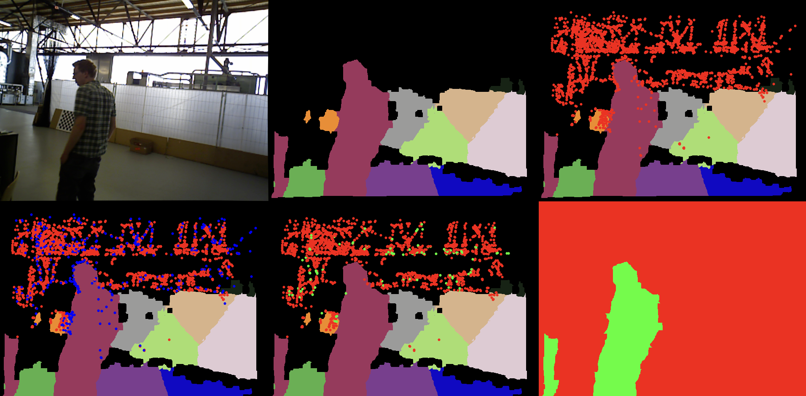

# Dynamic Region Detection for Indoor RGB-D Scenes
## indoSLAM

This script detects dynamic regions between two RGB-D frames using depth-based clustering and ORB feature matching.

## Requirements

- Python 3
- OpenCV
- NumPy
- scikit-learn

### Install Dependencies

```bash
pip install opencv-python numpy scikit-learn
```
Folder Structure
The script expects RGB and depth images organized as follows:

```
tests/
└── test1/
    ├── rgb/
    │   ├── 1.png
    │   └── 2.png
    └── depth/
        ├── 1.png
        └── 2.png
```

## Run
```bash
python main.py
```

### Output
A window will display a 6-panel visualization:

- Original RGB frame

- 3D K-means cluster segmentation

- ORB feature visualization

- First-pass inlier/outlier matches

- Second-pass refined inliers

- Final detected dynamic regions



## Notes
- Script assumes a static camera with predefined intrinsics

- Adjust intrinsics in the script if needed

- You can change test_image_set_idx to use other folders (e.g. test3/)


## Dataset

This project uses data from the [TUM RGB-D dataset](https://vision.in.tum.de/data/datasets/rgbd-dataset), specifically the `freiburg3_walking_rpy` sequence.

J. Sturm, N. Engelhard, F. Endres, W. Burgard and D. Cremers,  
"A benchmark for the evaluation of RGB-D SLAM systems",  
*Proc. of the International Conference on Intelligent Robot Systems (IROS)*, 2012.
